# Amazon FSx SAA 考试深度解析

## 概述

Amazon FSx 是 AWS 提供的全托管第三方文件系统服务家族，支持四种主流文件系统：**Windows File Server**、**Lustre**、**NetApp ONTAP** 和 **OpenZFS**。FSx 的核心价值在于让用户无需管理底层硬件和软件即可使用熟悉的企业级文件系统。

> [!IMPORTANT]
> **SAA 考试核心考点**：FSx 考题通常围绕"选择正确的文件系统类型"展开，需要根据协议需求、工作负载特性、集成需求来判断。

---

## 一、FSx for Windows File Server

### 1.1 核心特性

FSx for Windows File Server 是基于 Windows Server 构建的全托管共享文件存储服务。

| 特性 | 说明 | SAA 考试重点 |
|------|------|-------------|
| **SMB 协议** | 原生支持 SMB 2.0-3.1.1 协议 | Windows 工作负载的首选 |
| **NTFS 文件系统** | 完整支持 NTFS 语义和权限 | 支持 ACL、配额、审计 |
| **Active Directory 集成** | 与 AWS Managed AD 或自管理 AD 集成 | 企业用户身份认证 |
| **DFS 命名空间** | 支持分布式文件系统命名空间 | 跨区域/跨文件系统统一访问 |

### 1.2 SMB 协议深度解析

```
┌─────────────────────────────────────────────────────────────┐
│                    SMB 协议层次结构                          │
├─────────────────────────────────────────────────────────────┤
│  应用层    │ Windows 应用程序、Office、SQL Server           │
├─────────────────────────────────────────────────────────────┤
│  SMB 协议  │ SMB 2.0/2.1/3.0/3.1.1                          │
│           │ • SMB 3.0+: 加密传输、多通道、持久句柄           │
├─────────────────────────────────────────────────────────────┤
│  传输层    │ TCP 端口 445                                    │
└─────────────────────────────────────────────────────────────┘
```

**SMB vs NFS 协议对比（高频考点）**：

| 对比维度 | SMB | NFS |
|---------|-----|-----|
| **典型场景** | Windows 环境 | Linux/Unix 环境 |
| **认证方式** | Active Directory | Kerberos/AUTH_SYS |
| **权限模型** | NTFS ACL | POSIX 权限 |
| **锁机制** | 机会锁(Oplock) | 文件锁 |
| **AWS 服务** | FSx for Windows | EFS / FSx for ONTAP |

> [!TIP]
> **考试技巧**：题目中出现"Windows 应用程序"、"SMB"、"CIFS"、"Active Directory"等关键词，优先考虑 FSx for Windows File Server。

### 1.3 Active Directory 集成

FSx for Windows File Server **必须**与 Active Directory 集成，支持两种模式：

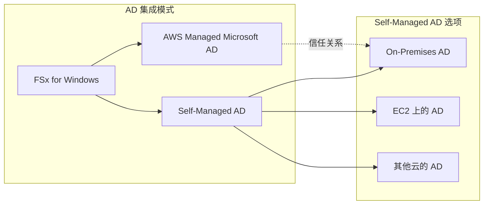

**AD 集成架构考点**：

| 集成模式 | 适用场景 | 网络要求 |
|---------|---------|---------|
| **AWS Managed AD** | 云原生部署、简化管理 | VPC 内部即可 |
| **Self-Managed AD（本地）** | 现有企业 AD、混合云 | VPN/Direct Connect |
| **信任关系模式** | 两套 AD 并存 | 双向或单向信任 |

> [!WARNING]
> **常见陷阱**：FSx for Windows **不支持**无 AD 的独立模式。如果题目场景中没有 AD 环境且只需简单文件共享，可能 EFS 是更好选择。

### 1.4 DFS 命名空间（DFS-N）

DFS 命名空间允许将多个文件共享组织到统一的命名空间中：

```
\\corp.example.com\share\
        ├── finance\     → FSx 文件系统 A（us-east-1）
        ├── engineering\ → FSx 文件系统 B（us-west-2）
        └── marketing\   → 本地文件服务器
```

**DFS 命名空间的 SAA 应用场景**：

| 场景 | DFS-N 作用 | 考试关键词 |
|------|-----------|-----------|
| **跨区域访问** | 统一入口点，用户无感知切换 | "多区域"、"统一命名空间" |
| **迁移过渡** | 渐进式迁移，不改变用户路径 | "无缝迁移"、"透明切换" |
| **负载分散** | 引用多个目标实现分流 | "扩展性"、"负载均衡" |

### 1.5 部署选项与性能

| 部署类型 | 特点 | 适用场景 | 可用性 SLA |
|---------|------|---------|-----------|
| **Single-AZ** | 单可用区部署 | 开发测试、成本敏感 | 99.9% |
| **Multi-AZ** | 主备跨可用区 | 生产工作负载 | 99.99% |

**存储类型选择**：

| 存储类型 | SSD | HDD |
|---------|-----|-----|
| **IOPS** | 高（3 IOPS/GB 基准） | 低（12 IOPS/GB 突发） |
| **吞吐量** | 高 | 适中 |
| **适用场景** | 数据库、用户主目录 | 归档、大文件存储 |
| **成本** | 较高 | 较低 |

### 1.6 备份与数据保护

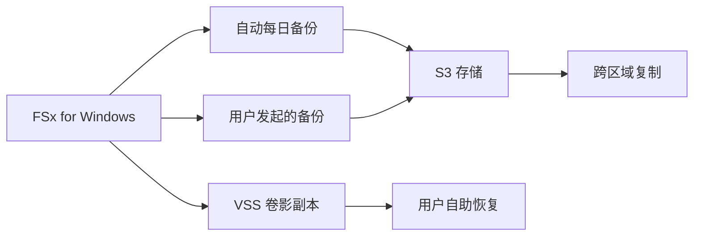

| 备份功能 | 说明 | RPO |
|---------|------|-----|
| **自动备份** | 每日备份，保留 0-90 天 | 24 小时 |
| **用户发起备份** | 随时创建按需备份 | 按需 |
| **VSS 卷影副本** | Windows 原生快照，用户可自助恢复 | 分钟级 |
| **AWS Backup 集成** | 统一备份管理 | 灵活策略 |

---

## 二、FSx for Lustre

### 2.1 核心特性

FSx for Lustre 是基于开源 Lustre 并行分布式文件系统的全托管服务，专为**高性能计算（HPC）**和**机器学习**工作负载设计。

```
┌──────────────────────────────────────────────────────────────┐
│                   FSx for Lustre 架构                         │
├──────────────────────────────────────────────────────────────┤
│                                                              │
│    ┌─────────┐  ┌─────────┐  ┌─────────┐  ┌─────────┐       │
│    │ 计算节点 │  │ 计算节点 │  │ 计算节点 │  │ 计算节点 │       │
│    └────┬────┘  └────┬────┘  └────┬────┘  └────┬────┘       │
│         │           │           │           │              │
│         └───────────┴─────┬─────┴───────────┘              │
│                           │                                │
│                    ┌──────┴──────┐                         │
│                    │  Lustre 客户端 │                         │
│                    └──────┬──────┘                         │
│                           │                                │
│    ┌──────────────────────┼──────────────────────┐         │
│    │              FSx for Lustre                 │         │
│    │  ┌─────────┐  ┌─────────┐  ┌─────────┐     │         │
│    │  │  MDS    │  │  OSS    │  │  OSS    │     │         │
│    │  │元数据服务│  │对象存储服务│  │对象存储服务│     │         │
│    │  └─────────┘  └─────────┘  └─────────┘     │         │
│    └─────────────────────────────────────────────┘         │
│                           │                                │
│                    ┌──────┴──────┐                         │
│                    │   Amazon S3  │                         │
│                    │  (可选集成)   │                         │
│                    └─────────────┘                         │
└──────────────────────────────────────────────────────────────┘
```

### 2.2 HPC 场景深度解析

**为什么 Lustre 适合 HPC**：

| 特性 | 说明 | 对比 EFS |
|------|------|---------|
| **并行访问** | 数据条带化分布在多个存储服务器 | 单一存储后端 |
| **高吞吐量** | 可达数百 GB/s 聚合吞吐量 | 最高数 GB/s |
| **低延迟** | 亚毫秒级延迟 | 低毫秒级 |
| **POSIX 兼容** | 完整 POSIX 语义，HPC 应用无需修改 | POSIX 兼容 |

**典型 HPC 应用场景**：

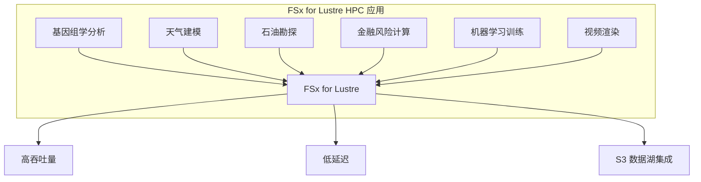

> [!IMPORTANT]
> **考试关键识别点**：题目中出现"HPC"、"高性能计算"、"机器学习训练"、"大规模并行处理"、"基因组学"、"CFD（计算流体力学）"等关键词，**立即想到 FSx for Lustre**。

### 2.3 S3 集成（Data Repository）

FSx for Lustre 与 S3 的集成是其最重要的特性之一：

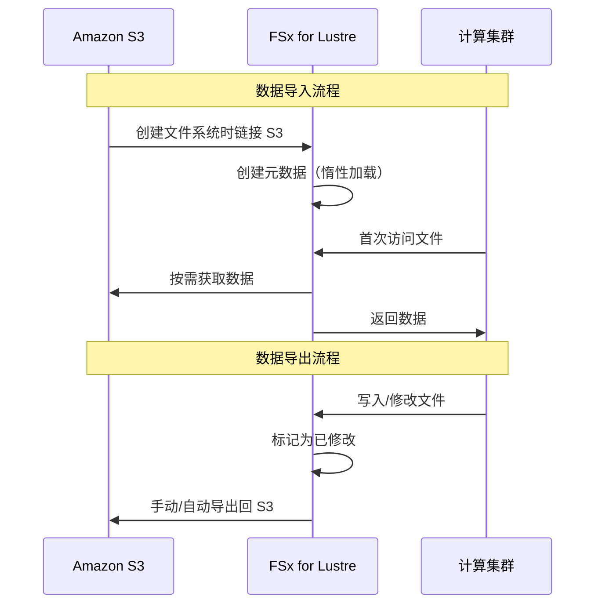

**S3 集成模式详解**：

| 功能 | 说明 | 命令/配置 |
|------|------|----------|
| **惰性加载（Lazy Loading）** | 仅在首次访问时从 S3 加载数据 | 默认行为 |
| **预加载（Preload）** | 批量预加载 S3 数据到 FSx | `hsm_restore` 命令 |
| **自动导入** | S3 变更自动同步到 FSx 元数据 | Auto Import 配置 |
| **自动导出** | FSx 变更自动写回 S3 | Auto Export 配置 |
| **数据仓库任务** | 批量导入/导出管理 | Data Repository Tasks |

> [!TIP]
> **考试场景**：当题目描述"大量数据存储在 S3，需要高性能处理后写回 S3"的场景时，FSx for Lustre + S3 集成是标准答案。

### 2.4 持久性 vs 临时性部署（关键考点）

| 对比维度 | Scratch（临时性） | Persistent（持久性） |
|---------|------------------|---------------------|
| **数据持久性** | 不复制，服务器故障数据丢失 | 复制到多个存储服务器 |
| **适用场景** | 临时处理、短期计算任务 | 长期存储、生产工作负载 |
| **成本** | **更低（约 1/6 价格）** | 较高 |
| **性能** | 200 MB/s/TiB 基准 | 50/100/200 MB/s/TiB 可选 |
| **数据来源** | 处理来自 S3 的数据 | 原生存储或 S3 集成 |

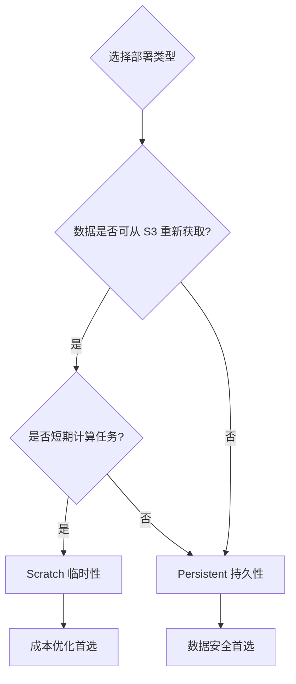

> [!WARNING]
> **考试陷阱**：
> - Scratch 类型**不提供数据复制**，服务器故障会导致数据丢失
> - 如果原始数据在 S3 中且可重新处理，Scratch 是**成本优化**的正确答案
> - 如果强调"数据不能丢失"、"生产环境"，必须选择 Persistent

### 2.5 性能配置

**Persistent 部署吞吐量选项**：

| 吞吐量层级 | MB/s per TiB | 适用场景 |
|-----------|--------------|---------|
| 50 | 50 | 冷数据、归档访问 |
| 100 | 100 | 一般工作负载 |
| 200 | 200 | 高性能工作负载 |

**Scratch 部署**：
- 固定 200 MB/s per TiB
- 更高的基准性能
- 适合突发、高强度计算

---

## 三、FSx for NetApp ONTAP

### 3.1 核心特性

FSx for NetApp ONTAP 是基于 NetApp 企业级存储操作系统的全托管服务，提供业界最丰富的数据管理功能。

```
┌──────────────────────────────────────────────────────────────┐
│              FSx for NetApp ONTAP 核心价值                    │
├──────────────────────────────────────────────────────────────┤
│  ┌─────────────┐  ┌─────────────┐  ┌─────────────┐          │
│  │  多协议支持   │  │  企业级功能   │  │  混合云集成   │          │
│  │  NFS + SMB   │  │  快照/克隆    │  │  SnapMirror  │          │
│  │  + iSCSI    │  │  压缩/去重    │  │  FlexClone   │          │
│  └─────────────┘  └─────────────┘  └─────────────┘          │
└──────────────────────────────────────────────────────────────┘
```

### 3.2 多协议支持（关键差异化特性）

| 协议 | 端口 | 典型客户端 | 用途 |
|------|------|-----------|------|
| **NFS** | 2049 | Linux/Unix | 文件共享 |
| **SMB** | 445 | Windows | 文件共享 |
| **iSCSI** | 3260 | 任意 OS | 块存储（SAN） |

**多协议共存架构**：

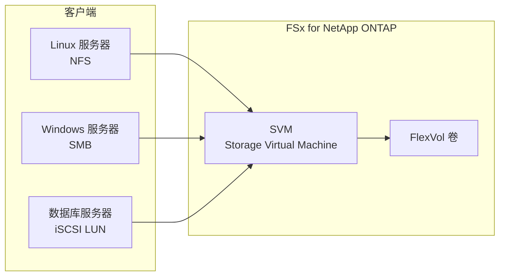

> [!IMPORTANT]
> **考试关键点**：当题目描述"Windows 和 Linux 混合环境需要共享同一文件系统"、"需要同时支持 NFS 和 SMB"时，**FSx for NetApp ONTAP 是首选**（EFS 仅支持 NFS，FSx for Windows 仅支持 SMB）。

### 3.3 快照（Snapshot）技术

NetApp 快照是 ONTAP 的核心数据保护功能：

```
┌───────────────────────────────────────────────────┐
│              NetApp 快照原理                       │
├───────────────────────────────────────────────────┤
│                                                   │
│  时间 T0: 活动文件系统                             │
│  ┌───────────────────────────────────────────┐   │
│  │ Block A │ Block B │ Block C │ Block D     │   │
│  └───────────────────────────────────────────┘   │
│              │                                   │
│              ▼ 创建快照                           │
│  时间 T1: 快照 + 新写入                           │
│  ┌───────────────────────────────────────────┐   │
│  │ Block A │ Block B'│ Block C │ Block D'    │   │ 活动FS
│  └───────────────────────────────────────────┘   │
│              │                                   │
│  ┌───────────────────────────────────────────┐   │
│  │ Block A │ Block B │ Block C │ Block D     │   │ 快照
│  └─────────│─────────│─────────│─────────────┘   │
│         共享未修改块（写时复制 COW）               │
└───────────────────────────────────────────────────┘
```

**快照特性**：

| 特性 | 说明 | 考试重点 |
|------|------|---------|
| **空间效率** | 只存储变化的块（COW） | 成本优化 |
| **即时创建** | 毫秒级创建，无性能影响 | 低 RTO |
| **无限快照** | 每个卷最多 1023 个快照 | 灵活恢复点 |
| **用户可访问** | `.snapshot` 目录自助恢复 | 降低运维负担 |

### 3.4 SnapMirror（混合云灾难恢复）

SnapMirror 是 NetApp 的异步数据复制技术，支持：

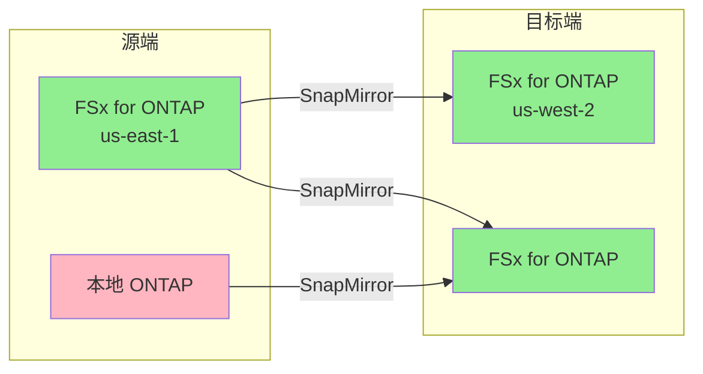

**SnapMirror 使用场景**：

| 场景 | 源 | 目标 | 考试关键词 |
|------|---|------|-----------|
| **云上 DR** | FSx ONTAP (主区域) | FSx ONTAP (DR 区域) | "跨区域灾难恢复" |
| **云迁移** | 本地 ONTAP | FSx ONTAP | "迁移到云"、"无缝迁移" |
| **混合云** | 本地 ONTAP | FSx ONTAP | "混合云架构"、"数据同步" |
| **云爆发** | FSx ONTAP | 本地 ONTAP | "云爆发"、"突发容量" |

> [!TIP]
> **考试场景**：题目描述"现有本地 NetApp 存储，需要迁移到 AWS 同时保持现有工具和流程"，**FSx for NetApp ONTAP + SnapMirror** 是最佳答案。

### 3.5 FlexClone（即时克隆）

FlexClone 创建卷的可写快照，无需复制数据：

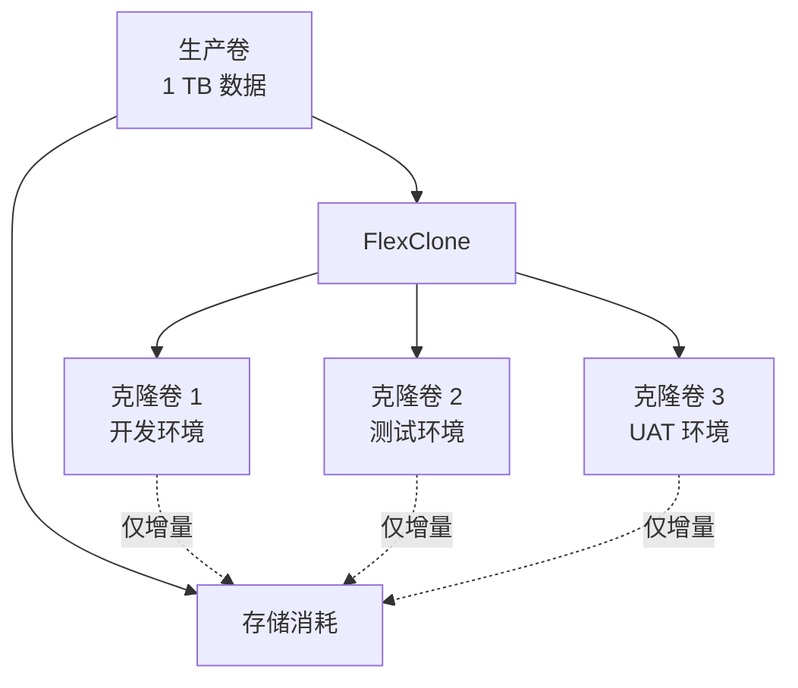

**FlexClone 应用场景**：

| 场景 | 传统方法 | FlexClone 优势 |
|------|---------|---------------|
| 开发测试环境 | 完整数据复制 | 秒级创建，零初始空间 |
| CI/CD 流水线 | 每次构建复制数据 | 即时提供生产级数据 |
| 数据分析 | 复制生产数据 | 空间效率高 |

### 3.6 存储效率功能

| 功能 | 说明 | 节省比例 |
|------|------|---------|
| **数据压缩** | 实时或后处理压缩 | 30-50% |
| **重复数据删除** | 块级去重 | 20-50% |
| **精简配置** | 按需分配物理存储 | 避免过度配置 |
| **数据压实** | 小数据合并存储 | 提高存储效率 |

> [!NOTE]
> 综合存储效率可达 **2:1 到 5:1** 的数据缩减比，这对于**成本优化**类题目很重要。

---

## 四、FSx for OpenZFS

### 4.1 核心特性

FSx for OpenZFS 是基于 OpenZFS 文件系统的全托管服务，专为 Linux 工作负载设计。

```
┌──────────────────────────────────────────────────────────────┐
│              FSx for OpenZFS 核心能力                         │
├──────────────────────────────────────────────────────────────┤
│  ┌─────────────┐  ┌─────────────┐  ┌─────────────┐          │
│  │  ZFS 高级功能 │  │  简单迁移    │  │  高性能     │          │
│  │  快照/克隆   │  │  NFS 兼容   │  │  低延迟     │          │
│  │  压缩/配额   │  │  无需改应用  │  │  高 IOPS   │          │
│  └─────────────┘  └─────────────┘  └─────────────┘          │
└──────────────────────────────────────────────────────────────┘
```

### 4.2 ZFS 关键功能

| 功能 | 说明 | 与 EFS 对比 |
|------|------|-----------|
| **快照** | 即时、空间高效的时间点副本 | EFS 无原生快照 |
| **克隆** | 从快照创建可写副本 | 需要完整复制 |
| **压缩** | LZ4/ZSTD 透明压缩 | 无压缩 |
| **配额** | 用户/组/项目级配额 | 无原生配额 |
| **数据完整性** | 端到端校验和 | 静默数据损坏保护 |

### 4.3 典型使用场景

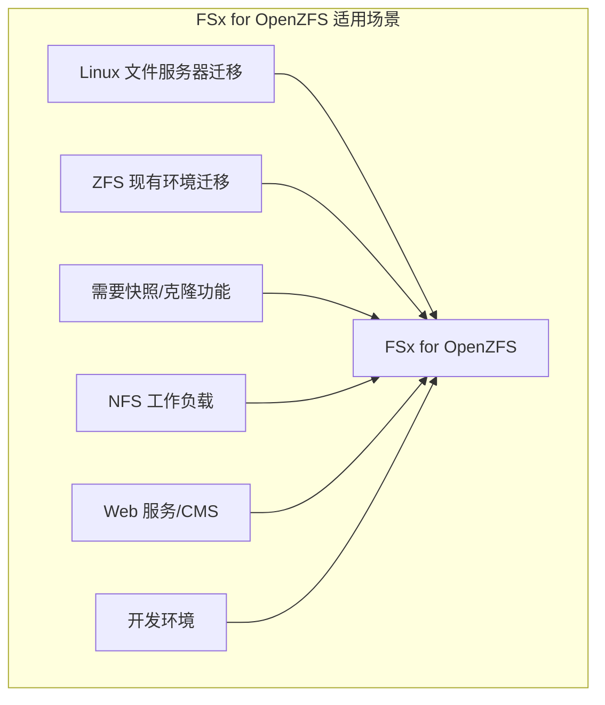

**选择 OpenZFS 的关键场景**：

| 场景 | 原因 | 考试关键词 |
|------|------|-----------|
| ZFS 迁移 | 功能兼容，无需修改应用 | "现有 ZFS"、"迁移" |
| 需要快照 | 比 EFS 更强大的数据保护 | "时间点恢复"、"快照" |
| 高性能 NFS | 比 EFS 更低延迟 | "低延迟"、"IOPS" |
| 简单 Linux 共享 | 运维简单，功能丰富 | "文件共享"、"Linux" |

---

## 五、FSx 文件系统选择决策指南

### 5.1 快速决策流程图

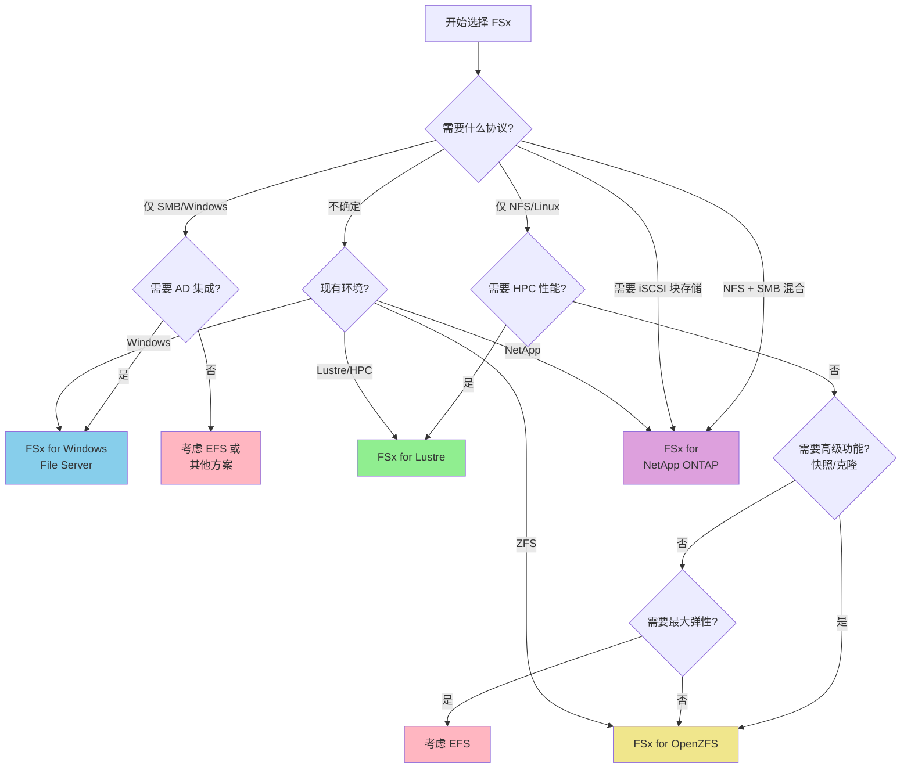

### 5.2 全面对比表

| 对比维度 | FSx for Windows | FSx for Lustre | FSx for ONTAP | FSx for OpenZFS | EFS |
|---------|----------------|----------------|---------------|-----------------|-----|
| **协议** | SMB | POSIX/Lustre | NFS + SMB + iSCSI | NFS | NFS |
| **典型客户端** | Windows | Linux (HPC) | 混合环境 | Linux | Linux |
| **AD 集成** | **必需** | 无 | 可选 | 无 | 无 |
| **性能定位** | 通用 | **极致吞吐** | 企业级 | 高性能 | 弹性 |
| **S3 集成** | 无 | **原生集成** | 无 | 无 | 无 |
| **快照** | VSS | 无 | **高级快照** | **ZFS 快照** | AWS Backup |
| **多 AZ** | ✓ | ✓ | ✓ | ✓ | **自动** |
| **自动扩展** | 手动 | 手动 | 手动 | 手动 | **自动** |
| **本地系统迁移** | Windows Server | Lustre | **NetApp** | **ZFS** | NFS |

### 5.3 按场景选择指南

#### 场景 1：Windows 企业应用

```
关键词：Windows、SMB、Active Directory、SQL Server、SharePoint、
       用户主目录、组策略、NTFS 权限

答案：FSx for Windows File Server
```

#### 场景 2：高性能计算 (HPC)

```
关键词：HPC、机器学习训练、基因组学、CFD、渲染、大规模并行、
       高吞吐量、S3 数据处理

答案：FSx for Lustre
```

#### 场景 3：混合协议/NetApp 迁移

```
关键词：NFS + SMB、Windows 和 Linux 共存、NetApp 迁移、
       SnapMirror、企业级存储、多协议

答案：FSx for NetApp ONTAP
```

#### 场景 4：Linux 文件服务器/ZFS 迁移

```
关键词：ZFS、Linux 文件服务器、快照需求、简单 NFS 共享、
       开发环境、Web 服务器

答案：FSx for OpenZFS
```

#### 场景 5：弹性 Linux 共享存储

```
关键词：无服务器、弹性扩展、按使用付费、ECS/EKS、Lambda、
       多 AZ 自动、区域级存储

答案：Amazon EFS（不是 FSx）
```

---

## 六、SAA 考试高频场景分析

### 6.1 成本优化类题目

| 场景 | 最优选择 | 理由 |
|------|---------|------|
| 临时 HPC 计算，数据在 S3 | FSx for Lustre Scratch | Scratch 成本最低，数据可从 S3 恢复 |
| 开发测试环境 Windows | FSx for Windows Single-AZ + HDD | 单 AZ 节省成本，HDD 适合非关键负载 |
| 减少存储量 | FSx for ONTAP | 压缩+去重+精简配置可节省 50-80% |
| 短期项目 | FSx for Lustre Scratch | 作业完成后删除，无长期成本 |

### 6.2 高可用/容错类题目

| 场景 | 最优选择 | 理由 |
|------|---------|------|
| 关键业务 Windows 应用 | FSx for Windows Multi-AZ | 自动故障转移，99.99% SLA |
| 多区域灾难恢复 | FSx for ONTAP + SnapMirror | 跨区域异步复制 |
| 数据不能丢失的 HPC | FSx for Lustre Persistent | 数据复制到多个存储服务器 |
| 生产级 Linux 存储 | FSx for OpenZFS/ONTAP Multi-AZ | 跨 AZ 冗余 |

### 6.3 安全类题目

| 需求 | 实现方式 |
|------|---------|
| 静态加密 | 所有 FSx 类型默认支持 KMS 加密 |
| 传输加密 | SMB 3.0+、NFS Kerberos、TLS |
| 身份认证 | AD (Windows/ONTAP)、IAM、Kerberos |
| 网络隔离 | VPC、安全组、VPC 端点 |
| 审计 | CloudTrail、Windows 审计日志 |

### 6.4 性能类题目

| 需求 | 最优选择 | 说明 |
|------|---------|------|
| 最高吞吐量 | FSx for Lustre | 数百 GB/s 聚合吞吐 |
| 最低延迟 | FSx for OpenZFS/ONTAP | 亚毫秒级延迟 |
| 高 IOPS 随机读写 | FSx for Windows SSD / ONTAP | 适合数据库工作负载 |
| 大文件顺序 I/O | FSx for Lustre | HPC 典型模式 |

---

## 七、常见考题陷阱与易混淆点

### 7.1 FSx for Lustre Scratch vs Persistent

> [!CAUTION]
> **陷阱**：Scratch 类型虽然性能更高、成本更低，但**不复制数据**！
> 
> - ✅ 选择 Scratch：数据可从 S3 重新获取、短期计算任务
> - ✅ 选择 Persistent：需要持久存储、数据不可丢失

### 7.2 FSx for Windows vs EFS

| 问题 | FSx for Windows | EFS |
|------|----------------|-----|
| 必须使用 AD 吗？ | **是，必须** | 否 |
| 支持 Linux 吗？ | 可以（通过 SMB 客户端） | **原生支持** |
| 自动扩展？ | 否，需手动 | **是** |
| Windows 应用？ | **最佳选择** | 不适合 SMB 应用 |

### 7.3 FSx for ONTAP vs 其他 FSx

当需要同时满足以下任一条件时，选择 ONTAP：
- ✓ 同时需要 NFS 和 SMB
- ✓ 需要 iSCSI 块存储
- ✓ 现有 NetApp 环境迁移
- ✓ 需要 SnapMirror 跨区域/混合云复制
- ✓ 需要 FlexClone 即时克隆

### 7.4 FSx vs EFS 选择

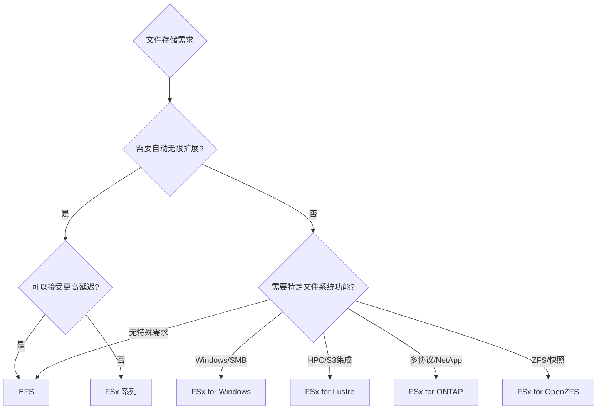

---

## 八、补充：Data Repository Association（DRA）特性（FSx for Lustre）

### 8.1 自动导入策略

| 策略 | 行为 | 用例 |
|------|------|------|
| **NEW** | 仅导入新创建的对象 | 增量数据处理 |
| **CHANGED** | 导入新建和修改的对象 | 实时数据同步 |
| **DELETED** | 同步删除操作 | 完整镜像 |
| **NEW_CHANGED_DELETED** | 完全同步 | 实时双向同步 |

### 8.2 自动导出策略

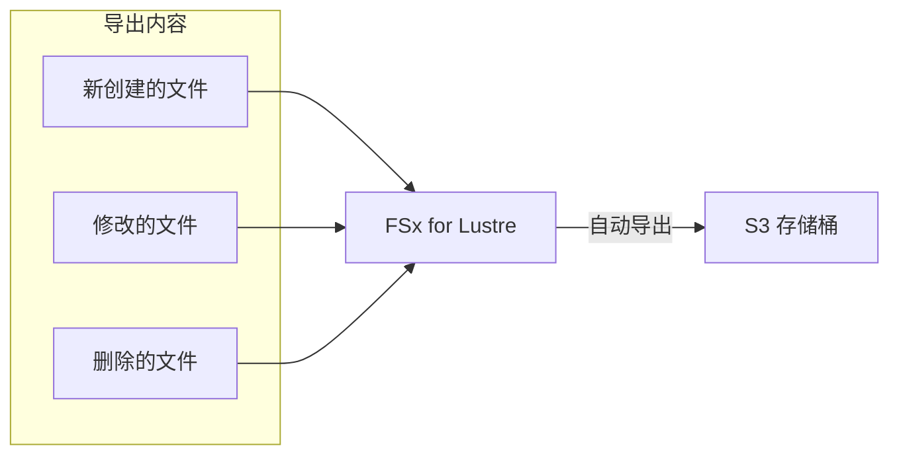

---

## 九、核心要点总结

### 9.1 一句话记忆法

| 文件系统 | 一句话定位 |
|---------|-----------|
| **FSx for Windows** | Windows 世界的托管文件服务器（AD 必需） |
| **FSx for Lustre** | HPC 和 ML 的极速存储（S3 好搭档） |
| **FSx for ONTAP** | 企业级多协议战士（NetApp 云替代） |
| **FSx for OpenZFS** | Linux ZFS 云端版（迁移神器） |
| **EFS** | 弹性无限的 Linux NFS（Serverless 首选） |

### 9.2 考试关键词速查

| 关键词 | 对应服务 |
|--------|---------|
| Windows、SMB、CIFS、AD、DFS | FSx for Windows |
| HPC、Lustre、高吞吐、ML 训练、S3 处理 | FSx for Lustre |
| 多协议、NFS+SMB、NetApp、SnapMirror、iSCSI | FSx for ONTAP |
| ZFS、Linux 迁移、快照克隆 | FSx for OpenZFS |
| 弹性扩展、无服务器、ECS/Lambda | EFS |

> [!IMPORTANT]
> **最终提醒**：SAA 考试中的 FSx 题目核心是**场景匹配**。识别关键需求（协议、性能、功能、现有环境），然后选择最匹配的服务。当多个选项看似都可行时，关注题目中的**限定条件**（如"最小运营开销"、"成本优化"、"与现有系统兼容"）。
