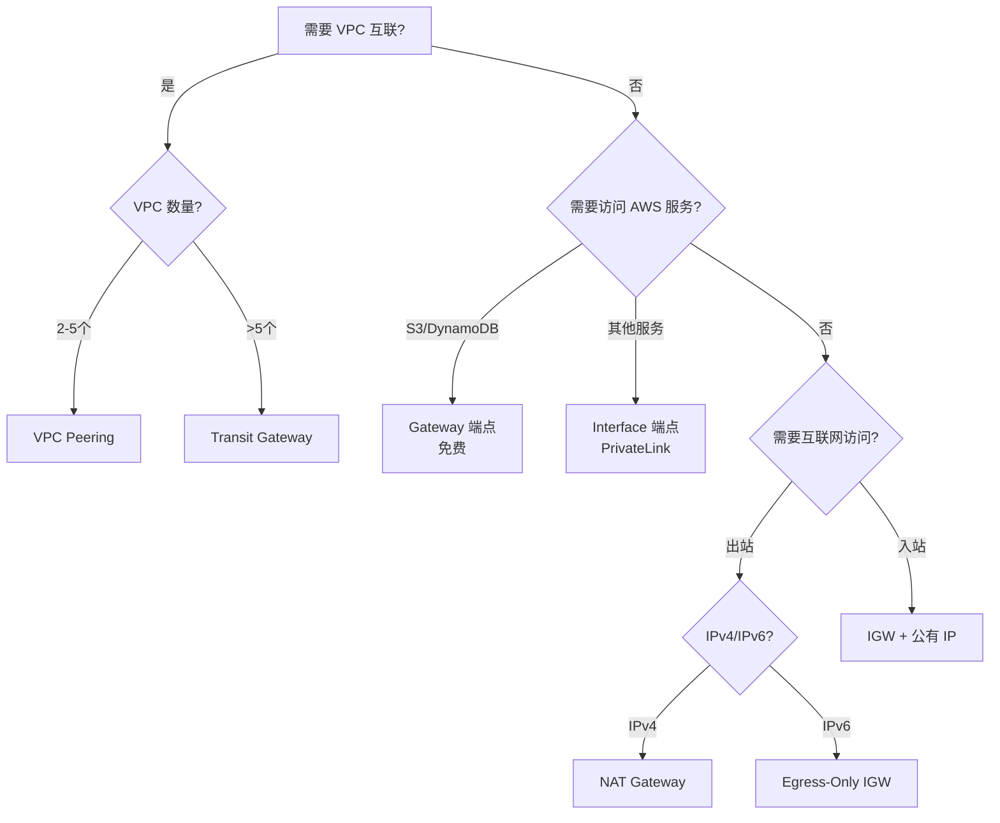

# Amazon VPC SAA 深度解析

> **核心架构思想**: 成本优化 | 高可用与容错 | 安全最佳实践 | 性能优化

---

## 目录
1. [VPC 基础架构](#1-vpc-基础架构)
2. [子网设计](#2-子网设计公有私有隔离)
3. [路由表配置](#3-路由表配置)
4. [互联网连接](#4-互联网连接)
5. [VPC 连接选项](#5-vpc-连接选项)
6. [VPC 端点](#6-vpc-端点)
7. [安全控制](#7-安全控制)
8. [网络监控与故障排除](#8-网络监控与故障排除)
9. [高级网络功能](#9-高级网络功能)
10. [考点对比总结](#10-考点对比总结)

---

## 1. VPC 基础架构

### 1.1 CIDR 规划与扩展

**基本概念**:
- VPC CIDR 范围: `/16` (65,536 IPs) 到 `/28` (16 IPs)
- 推荐使用 RFC 1918 私有地址范围:
  - `10.0.0.0/8`
  - `172.16.0.0/12`
  - `192.168.0.0/16`

**CIDR 扩展**:
| 特性 | 说明 |
|------|------|
| 主 CIDR | 创建 VPC 时指定，**不可修改** |
| 辅助 CIDR | 最多可添加 **4个** 辅助 CIDR 块 |
| 扩展限制 | 辅助 CIDR 不能与主 CIDR 或其他辅助 CIDR 重叠 |

**SAA 考点**:
- ⚠️ 需要扩展 VPC 地址空间时 → 添加辅助 CIDR 块
- ⚠️ VPC Peering 要求 CIDR 不重叠 → 规划时预留地址空间

**成本优化**:
- 合理规划 CIDR 避免 IP 浪费
- 考虑未来扩展需求，预留足够地址空间

---

## 2. 子网设计（公有/私有/隔离）

### 2.1 子网类型对比

| 子网类型 | 路由表特征 | 典型用途 | 安全级别 |
|----------|------------|----------|----------|
| **公有子网** | 有到 IGW 的路由 (0.0.0.0/0 → IGW) | Web 服务器、堡垒机、NAT 网关 | 低 |
| **私有子网** | 有到 NAT 的路由 (0.0.0.0/0 → NAT) | 应用服务器、数据库 | 中 |
| **隔离子网** | 无互联网路由 | 敏感数据库、合规工作负载 | 高 |

### 2.2 子网设计最佳实践

```
┌─────────────────────────────────────────────────────────────┐
│                         VPC (10.0.0.0/16)                   │
├─────────────────────────────────────────────────────────────┤
│  AZ-a                          │  AZ-b                      │
│  ┌─────────────────────────┐   │  ┌─────────────────────────┐│
│  │ 公有子网 10.0.1.0/24    │   │  │ 公有子网 10.0.2.0/24    ││
│  │ [ALB] [NAT GW] [Bastion]│   │  │ [ALB] [NAT GW]          ││
│  └─────────────────────────┘   │  └─────────────────────────┘│
│  ┌─────────────────────────┐   │  ┌─────────────────────────┐│
│  │ 私有子网 10.0.11.0/24   │   │  │ 私有子网 10.0.12.0/24   ││
│  │ [EC2 App Servers]       │   │  │ [EC2 App Servers]       ││
│  └─────────────────────────┘   │  └─────────────────────────┘│
│  ┌─────────────────────────┐   │  ┌─────────────────────────┐│
│  │ 隔离子网 10.0.21.0/24   │   │  │ 隔离子网 10.0.22.0/24   ││
│  │ [RDS] [ElastiCache]     │   │  │ [RDS] [ElastiCache]     ││
│  └─────────────────────────┘   │  └─────────────────────────┘│
└─────────────────────────────────────────────────────────────┘
```

**高可用设计**:
- ✅ 每个 AZ 至少部署一个公有和私有子网
- ✅ 使用至少 **2个 AZ** 实现高可用
- ✅ 关键工作负载使用 **3个 AZ**

**SAA 考点**:
- 问题: "如何确保数据库不被互联网访问？" → **隔离子网**（无互联网路由）
- 问题: "私有子网实例如何访问互联网下载补丁？" → **NAT 网关**

---

## 3. 路由表配置

### 3.1 路由表基础

| 概念 | 说明 |
|------|------|
| 主路由表 | VPC 创建时自动创建，未显式关联的子网使用此表 |
| 自定义路由表 | 手动创建，显式关联到子网 |
| 本地路由 | 自动添加，用于 VPC 内部通信，**不可删除** |
| 路由优先级 | 最长前缀匹配（最具体的路由优先） |

### 3.2 路由表配置示例

**公有子网路由表**:
| 目标 | 目标类型 |
|------|----------|
| 10.0.0.0/16 | local |
| 0.0.0.0/0 | igw-xxx |

**私有子网路由表**:
| 目标 | 目标类型 |
|------|----------|
| 10.0.0.0/16 | local |
| 0.0.0.0/0 | nat-xxx |
| pl-xxx (S3) | vpce-xxx |

**SAA 考点**:
- ⚠️ 子网 = 公有 的判断依据是路由表中有到 **IGW** 的路由
- ⚠️ 每个子网只能关联 **一个** 路由表
- ⚠️ 一个路由表可以关联 **多个** 子网

---

## 4. 互联网连接

### 4.1 互联网网关 (IGW)

**核心特性**:
- 水平扩展、冗余、高可用（AWS 托管）
- 每个 VPC 只能附加 **一个** IGW
- 支持 IPv4 和 IPv6
- **免费**（不收取额外费用）

**工作原理**:
- 执行 NAT（网络地址转换）: 私有 IP ↔ 公有/弹性 IP
- 实例需要公有 IP 或弹性 IP 才能通过 IGW 访问互联网

### 4.2 NAT 网关 vs NAT 实例

| 对比维度 | NAT 网关 | NAT 实例 |
|----------|----------|----------|
| **可用性** | AWS 托管，AZ 内高可用 | 需自行配置（脚本/ASG） |
| **带宽** | 最高 100 Gbps | 取决于实例类型 |
| **维护** | AWS 管理，无需维护 | 自行管理（补丁、更新） |
| **成本** | 按小时 + 数据处理费 | EC2 实例费用 |
| **安全组** | ❌ 不支持 | ✅ 支持 |
| **堡垒机功能** | ❌ 不支持 | ✅ 可复用 |
| **端口转发** | ❌ 不支持 | ✅ 支持 |

**NAT 网关高可用架构**:
```
┌─────────────────────────────────────────────────────────────┐
│                         VPC                                 │
│  ┌──────────────────────┐    ┌──────────────────────┐      │
│  │      AZ-a            │    │      AZ-b            │      │
│  │  ┌────────────────┐  │    │  ┌────────────────┐  │      │
│  │  │  NAT Gateway   │  │    │  │  NAT Gateway   │  │      │
│  │  │  (nat-gw-a)    │  │    │  │  (nat-gw-b)    │  │      │
│  │  └───────┬────────┘  │    │  └───────┬────────┘  │      │
│  │          │           │    │          │           │      │
│  │  ┌───────▼────────┐  │    │  ┌───────▼────────┐  │      │
│  │  │ Private Subnet │  │    │  │ Private Subnet │  │      │
│  │  │ RT: 0.0.0.0/0  │  │    │  │ RT: 0.0.0.0/0  │  │      │
│  │  │ → nat-gw-a     │  │    │  │ → nat-gw-b     │  │      │
│  │  └────────────────┘  │    │  └────────────────┘  │      │
│  └──────────────────────┘    └──────────────────────┘      │
└─────────────────────────────────────────────────────────────┘
```

**SAA 考点 - 成本 vs 高可用权衡**:

| 场景 | 推荐方案 |
|------|----------|
| 生产环境，高可用优先 | 每个 AZ 部署一个 NAT 网关 |
| 开发/测试，成本优先 | 单个 NAT 网关（接受单点故障） |
| 需要安全组/端口转发 | NAT 实例 |
| 极致成本优化 | NAT 实例 (t3.micro) |

### 4.3 仅出口互联网网关 (Egress-Only Internet Gateway)

**专用于 IPv6**:
- IPv6 地址都是全局唯一的公有地址
- 仅出口网关允许 IPv6 实例发起出站连接
- **阻止**互联网发起的入站连接
- 类似于 IPv4 的 NAT 网关功能

**SAA 考点**:
- 问题: "IPv6 实例需要访问互联网但不允许被互联网访问" → **Egress-Only IGW**
- ⚠️ NAT 网关 **不支持 IPv6**

---

## 5. VPC 连接选项

### 5.1 VPC 对等连接 (VPC Peering)

**核心特性**:
- 两个 VPC 之间的私有网络连接
- 可跨账户、跨区域
- **非传递性**: A↔B, B↔C, 但 A ✗ C

```
     VPC-A ←──── Peering ────→ VPC-B
       ↑                          ↑
       │                          │
    Peering                    Peering
       │                          │
       ↓                          ↓
     VPC-C ←─── ✗ 不互通 ───→ VPC-D (需单独建立 Peering)
```

**配置要求**:
- CIDR 块不能重叠
- 双方需要更新路由表
- 可使用安全组互相引用（同区域）

**SAA 考点**:
- 问题: "多个 VPC 需要互相通信" → 少量 VPC 用 **Peering**，大量 VPC 用 **Transit Gateway**
- ⚠️ 非传递性是常考陷阱

### 5.2 Transit Gateway (TGW)

**核心概念**:
- 区域级网络枢纽
- 解决 VPC Peering 的非传递性限制
- 支持连接: VPC、VPN、Direct Connect、其他 TGW

**架构对比**:

| 场景 | VPC Peering | Transit Gateway |
|------|-------------|-----------------|
| 2-3 个 VPC | ✅ 推荐 | 可用但成本高 |
| 10+ 个 VPC | 管理复杂 (n²连接) | ✅ 推荐 |
| 需要集中式路由 | ❌ 不支持 | ✅ 支持 |
| 需要传递性路由 | ❌ 不支持 | ✅ 支持 |
| 成本敏感 | ✅ 免费 | 按小时+数据费 |

**Transit Gateway 架构**:
```
                    ┌─────────────────┐
                    │ Transit Gateway │
                    └────────┬────────┘
           ┌─────────────────┼─────────────────┐
           │                 │                 │
      ┌────▼────┐      ┌────▼────┐      ┌────▼────┐
      │  VPC-A  │      │  VPC-B  │      │  VPC-C  │
      └─────────┘      └─────────┘      └─────────┘
           │                 │                 │
      ┌────▼────┐      ┌────▼────┐      ┌────▼────┐
      │  VPN    │      │  DX     │      │ Peering │
      │本地数据中心│      │数据中心  │      │ 其他TGW │
      └─────────┘      └─────────┘      └─────────┘
```

**SAA 考点**:
- 问题: "需要简化多 VPC 网络架构" → **Transit Gateway**
- 问题: "需要集中式网络管理和监控" → **Transit Gateway**
- 问题: "连接本地数据中心到多个 VPC" → **Transit Gateway + VPN/DX**

### 5.3 VPC 共享 (VPC Sharing)

**使用 AWS RAM (Resource Access Manager)**:
- 允许多个 AWS 账户共享子网
- 所有者账户拥有 VPC 和子网
- 参与者账户可在共享子网中启动资源

**优势**:
- 减少 VPC 数量
- 简化网络管理
- 降低成本（无需 VPC Peering/TGW）

**SAA 考点**:
- 问题: "组织内多账户需要使用同一网络" → **VPC 共享 + AWS RAM**

---

## 6. VPC 端点

### 6.1 端点类型对比

| 特性 | Gateway 端点 | Interface 端点 (PrivateLink) |
|------|--------------|------------------------------|
| **支持服务** | S3, DynamoDB **仅此两个** | 大多数 AWS 服务 |
| **成本** | **免费** | 按小时 + 数据处理费 |
| **网络** | 路由表条目 | ENI (弹性网络接口) |
| **访问方式** | 公有 DNS 名称 | 私有 DNS 名称 |
| **跨区域** | ❌ 同区域 | ❌ 同区域 |
| **本地访问** | ❌ 不支持 | ✅ 通过 VPN/DX |

### 6.2 Gateway 端点详解

**工作原理**:
```
┌─────────────────────────────────────────────────────────────┐
│                         VPC                                 │
│  ┌────────────────────┐                                    │
│  │   Private Subnet   │                                    │
│  │   ┌────────────┐   │         ┌─────────────────┐        │
│  │   │   EC2      │───┼────────→│ Gateway Endpoint│        │
│  │   └────────────┘   │         │   (S3/DynamoDB) │        │
│  └────────────────────┘         └────────┬────────┘        │
│                                          │                 │
│  路由表: pl-xxx → vpce-xxx               │                 │
└──────────────────────────────────────────┼─────────────────┘
                                           │
                                           ▼
                                    ┌─────────────┐
                                    │  S3 Bucket  │
                                    │  DynamoDB   │
                                    └─────────────┘
```

**配置要点**:
- 在路由表中添加前缀列表 (pl-xxx) 指向端点
- 可使用端点策略限制访问
- 支持 S3 存储桶策略限制

### 6.3 Interface 端点 (PrivateLink) 详解

**工作原理**:
```
┌─────────────────────────────────────────────────────────────┐
│                       Consumer VPC                          │
│  ┌────────────────────┐   ┌─────────────────────────────┐  │
│  │   Private Subnet   │   │     Interface Endpoint      │  │
│  │   ┌────────────┐   │   │   ┌─────────────────────┐   │  │
│  │   │   EC2      │───┼───┼──→│   ENI (10.0.1.5)    │   │  │
│  │   └────────────┘   │   │   └──────────┬──────────┘   │  │
│  └────────────────────┘   └──────────────┼──────────────┘  │
└──────────────────────────────────────────┼─────────────────┘
                                           │ AWS PrivateLink
                                           ▼
┌─────────────────────────────────────────────────────────────┐
│                    AWS Service / Provider VPC               │
│              (如: Secrets Manager, SNS, SQS 等)              │
└─────────────────────────────────────────────────────────────┘
```

**PrivateLink 用例**:
| 场景 | 说明 |
|------|------|
| 访问 AWS 服务 | 如 Secrets Manager, SSM, CloudWatch |
| 访问第三方 SaaS | 通过 AWS Marketplace |
| 暴露自己的服务 | 通过 NLB + Endpoint Service |

**高可用配置**:
- 每个 AZ 创建一个 ENI
- 自动故障转移到同 AZ 的其他 ENI

**SAA 考点**:
- 问题: "私有子网访问 S3 不经过互联网" → **Gateway 端点**（免费）
- 问题: "私有子网访问 Secrets Manager" → **Interface 端点**
- 问题: "本地数据中心访问 S3" → **Interface 端点**（可通过 VPN/DX 访问）
- ⚠️ Gateway 端点 **不支持** 从本地数据中心访问

---

## 7. 安全控制

### 7.1 安全组 vs 网络 ACL 详细对比

| 对比维度 | 安全组 (Security Group) | 网络 ACL (NACL) |
|----------|------------------------|-----------------|
| **状态** | **有状态** | **无状态** |
| **作用级别** | 实例 (ENI) 级别 | 子网级别 |
| **规则类型** | 仅允许规则 | 允许 + 拒绝规则 |
| **规则评估** | 评估所有规则 | 按编号顺序评估 |
| **默认行为** | 拒绝所有入站，允许所有出站 | 允许所有入站和出站 |
| **返回流量** | 自动允许 | 需显式规则 |
| **规则数量** | 默认 60 条入+60 条出 | 默认 20 条入+20 条出 |

**有状态 vs 无状态详解**:

```
┌─────────────────────────────────────────────────────────────┐
│                     有状态 (安全组)                          │
│  ┌──────┐   入站规则: 允许 80    ┌──────────┐               │
│  │Client│ ──────────────────────→│ EC2      │               │
│  │      │ ←──────────────────────│          │               │
│  └──────┘   返回流量: 自动允许    └──────────┘               │
│                                                             │
│  ✓ 只需配置入站规则，返回流量自动允许                          │
└─────────────────────────────────────────────────────────────┘

┌─────────────────────────────────────────────────────────────┐
│                     无状态 (NACL)                           │
│  ┌──────┐   入站规则: 允许 80    ┌──────────┐               │
│  │Client│ ──────────────────────→│ Subnet   │               │
│  │      │ ←─────────────────────×│          │               │
│  └──────┘   出站规则: 需配置      └──────────┘               │
│             临时端口 (1024-65535)                            │
│                                                             │
│  ✗ 必须同时配置入站和出站规则                                  │
└─────────────────────────────────────────────────────────────┘
```

**NACL 临时端口配置**:
| 客户端类型 | 临时端口范围 |
|------------|--------------|
| Linux | 32768-65535 |
| Windows | 49152-65535 |
| NAT Gateway | 1024-65535 |
| ELB | 1024-65535 |

### 7.2 AWS Network Firewall

**核心功能**:
| 功能 | 说明 |
|------|------|
| 有状态检查 | 深度包检查 (DPI) |
| 入侵防护 (IPS/IDS) | 检测和阻止恶意流量 |
| Web 过滤 | 基于域名/URL 过滤 |
| 协议检测 | 识别应用层协议 |
| 自定义规则 | Suricata 兼容规则 |

**架构位置**:
```
┌─────────────────────────────────────────────────────────────┐
│                         VPC                                 │
│  ┌─────────────────────────────────────────────────────┐   │
│  │              Firewall Subnet                         │   │
│  │  ┌─────────────────────────────────────────────┐    │   │
│  │  │         AWS Network Firewall                │    │   │
│  │  │   ┌──────────────────────────────────────┐  │    │   │
│  │  │   │ Firewall Endpoint (vpce-xxx)         │  │    │   │
│  │  │   └──────────────────────────────────────┘  │    │   │
│  │  └─────────────────────────────────────────────┘    │   │
│  └─────────────────────────────────────────────────────┘   │
│                            │                               │
│              路由所有流量通过防火墙端点                       │
│                            ▼                               │
│  ┌──────────────┐    ┌──────────────┐    ┌─────────────┐   │
│  │ Public Subnet│    │Private Subnet│    │Isolated Sub │   │
│  └──────────────┘    └──────────────┘    └─────────────┘   │
└─────────────────────────────────────────────────────────────┘
```

**SAA 考点 - 安全组 vs NACL vs Network Firewall**:

| 场景 | 推荐方案 |
|------|----------|
| 控制实例流量 | 安全组 |
| 控制子网流量 | NACL |
| 需要阻止特定 IP | NACL (支持拒绝规则) |
| 需要 IPS/IDS | AWS Network Firewall |
| 需要 URL/域名过滤 | AWS Network Firewall |
| 需要 DPI 深度包检查 | AWS Network Firewall |

---

## 8. 网络监控与故障排除

### 8.1 VPC 流日志 (Flow Logs)

**日志层级**:
| 层级 | 捕获范围 |
|------|----------|
| VPC | VPC 中所有 ENI 的流量 |
| 子网 | 子网中所有 ENI 的流量 |
| ENI | 特定 ENI 的流量 |

**日志目的地**:
| 目的地 | 用途 |
|--------|------|
| CloudWatch Logs | 实时监控和告警 |
| S3 | 长期存储和 Athena 分析 |
| Kinesis Data Firehose | 实时流处理 |

**流日志格式示例**:
```
version account-id interface-id srcaddr dstaddr srcport dstport protocol packets bytes start end action log-status
2 123456789012 eni-abc123 10.0.1.5 10.0.2.100 443 49152 6 12 840 1620000000 1620000060 ACCEPT OK
2 123456789012 eni-abc123 203.0.113.5 10.0.1.5 12345 22 6 5 300 1620000000 1620000060 REJECT OK
```

**常见故障排除**:
| 症状 | 可能原因 |
|------|----------|
| REJECT | 安全组或 NACL 阻止 |
| 入站 ACCEPT，出站 REJECT | NACL 未配置返回流量 |
| 无日志 | 流日志未启用/IAM 权限问题 |

**SAA 考点**:
- 问题: "分析网络流量模式" → **VPC 流日志 + Athena**
- 问题: "网络异常时快速发现问题" → **VPC 流日志 + CloudWatch**

### 8.2 Reachability Analyzer

**功能**:
- 自动化连接性测试
- 不发送实际流量
- 分析路由表、安全组、NACL
- 提供逐跳分析

**使用场景**:
| 场景 | 说明 |
|------|------|
| 验证网络配置 | 部署前验证连接性 |
| 故障排除 | 定位连接失败原因 |
| 合规审计 | 验证网络隔离 |

**SAA 考点**:
- 问题: "需要分析两点之间的网络可达性" → **Reachability Analyzer**
- 问题: "不发送流量情况下验证网络路径" → **Reachability Analyzer**

### 8.3 Network Access Analyzer

**功能**:
- 识别意外网络访问
- 分析整个 VPC 的网络可达性
- 基于网络访问范围定义

**与 Reachability Analyzer 对比**:
| 特性 | Reachability Analyzer | Network Access Analyzer |
|------|----------------------|------------------------|
| 范围 | 两个端点之间 | 整个 VPC/账户 |
| 用途 | 点对点连接分析 | 广泛的访问模式分析 |
| 合规 | 验证特定路径 | 发现意外访问 |

---

## 9. 高级网络功能

### 9.1 弹性网络接口 (ENI)

**核心概念**:
- 虚拟网卡
- 绑定到特定 AZ
- 可在同 AZ 实例间移动

**ENI 属性**:
| 属性 | 说明 |
|------|------|
| 私有 IPv4 地址 | 主要和辅助地址 |
| 公有 IPv4 地址 | 可选 |
| 弹性 IP | 可选，与 ENI 关联 |
| IPv6 地址 | 可选 |
| 安全组 | 可关联多个 |
| MAC 地址 | 固定 |
| 源/目标检查 | 可启用/禁用 |

**ENI 用例**:
| 场景 | 说明 |
|------|------|
| 管理网络 | 将管理流量与生产流量分离 |
| 网络设备 | NAT、代理、负载均衡 |
| 双宿主实例 | 多网络接入 |
| MAC 许可 | 依赖 MAC 地址的软件许可 |
| 故障转移 | 快速将 ENI 移到备用实例 |

**SAA 考点**:
- 问题: "需要在实例之间快速移动 IP" → **ENI + 弹性 IP**
- 问题: "需要多个网络接口隔离流量" → **多 ENI 配置**

### 9.2 增强型网络

**弹性网络适配器 (ENA)**:
- 高达 **100 Gbps** 带宽
- 低延迟
- 高 PPS (packets per second)
- 大多数现代实例类型支持

**弹性结构适配器 (EFA)**:
- 用于 HPC 工作负载
- 支持 OS-bypass
- MPI 应用优化

---

## 10. 考点对比总结

### 10.1 连接方式选择



### 10.2 成本优化速查表

| 组件 | 免费 | 收费 |
|------|------|------|
| VPC | ✅ | - |
| 子网 | ✅ | - |
| 路由表 | ✅ | - |
| IGW | ✅ | - |
| VPC Peering | ✅ (同 AZ 免跨区费) | 跨区域数据传输费 |
| Gateway 端点 | ✅ | - |
| Interface 端点 | - | 按小时 + 数据费 |
| NAT Gateway | - | 按小时 + 数据处理费 |
| Transit Gateway | - | 按小时 + 数据处理费 |
| Network Firewall | - | 按小时 + 数据处理费 |

### 10.3 高可用设计检查清单

- [ ] 多 AZ 子网部署
- [ ] 每个 AZ 独立 NAT 网关 (生产环境)
- [ ] 关键工作负载跨 3 个 AZ
- [ ] 使用托管服务 (NAT GW) 而非自管理 (NAT Instance)
- [ ] 多 AZ 的 Interface 端点
- [ ] 网络监控和告警 (Flow Logs + CloudWatch)

### 10.4 安全最佳实践检查清单

- [ ] 使用安全组作为主要防护层
- [ ] 最小权限原则配置入站规则
- [ ] 敏感资源放置于隔离子网
- [ ] 使用 VPC 端点避免公网暴露
- [ ] 启用 VPC 流日志用于审计
- [ ] 需要时使用 Network Firewall 增强防护
- [ ] 定期使用 Network Access Analyzer 检查

---

## 附录: SAA 常见题型

### 题型1: 子网类型判断
> "Web 服务器需要被互联网访问，应放在哪种子网？"
**答案**: 公有子网 (具有到 IGW 的路由)

### 题型2: NAT 方案选择
> "私有子网实例需要下载补丁，需要高可用，推荐什么方案？"
**答案**: 每个 AZ 部署 NAT 网关

### 题型3: 端点类型选择
> "私有子网 EC2 需要访问 S3，不经过互联网，最具成本效益的方案？"
**答案**: Gateway 端点 (免费)

### 题型4: 多 VPC 连接
> "公司有 15 个 VPC 需要互相通信，推荐什么方案？"
**答案**: Transit Gateway (集中式管理)

### 题型5: 安全组 vs NACL
> "需要阻止特定 IP 地址访问子网，使用什么？"
**答案**: NACL (支持拒绝规则)

### 题型6: IPv6 出站
> "IPv6 实例需要发起互联网连接但不允许入站，使用什么？"
**答案**: Egress-Only 互联网网关

### 题型7: 网络故障排除
> "需要分析两个 EC2 之间的连接问题，推荐什么工具？"
**答案**: Reachability Analyzer

---

> **文档版本**: v1.0  
> **最后更新**: 2024-12
> **适用考试**: AWS Solutions Architect Associate (SAA-C03)
